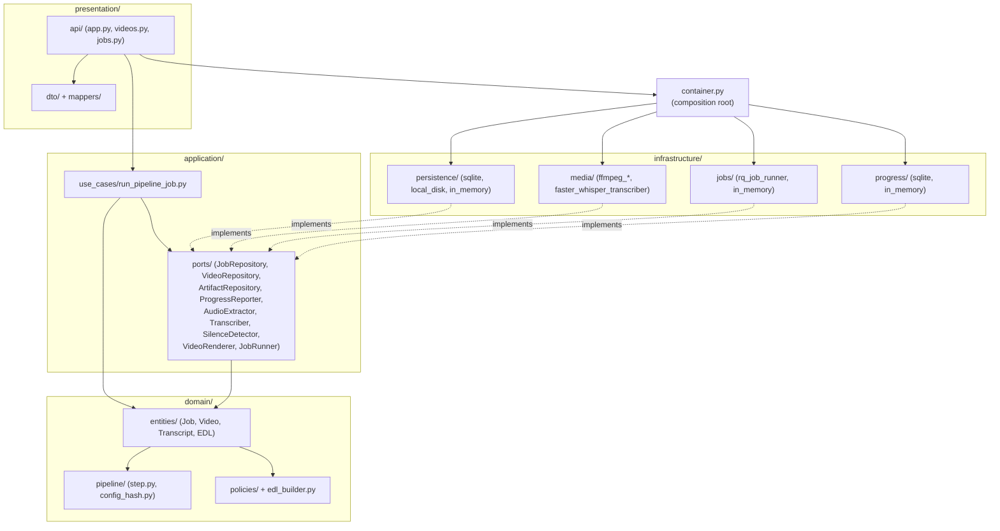
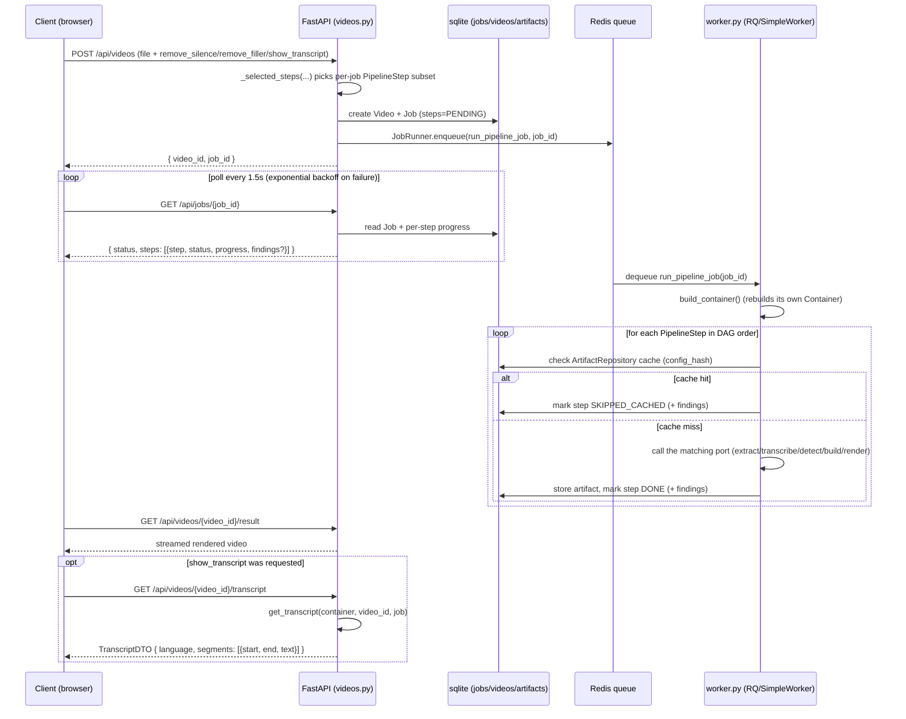
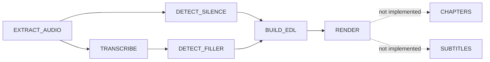

# Architecture

This document explains how deadair actually works end-to-end: the runtime flow of an upload
through the pipeline, and a layer-by-layer map of the server code. For the SOLID rationale
behind the hexagonal layering, see [SOLID_PRINCIPLES.md](SOLID_PRINCIPLES.md). For dev commands
and testing conventions, see [CLAUDE.md](CLAUDE.md).

## Overview

deadair is an automated video-editing pipeline: upload a video, extract its audio, transcribe
it, detect silence and filler words, build an EDL (edit decision list), and render the cut.
Users can also opt into a plain transcript instead of (or alongside) cutting. The backend
(`server/`) is a Python/FastAPI app built as a strict hexagonal / ports-and-adapters
architecture; the frontend (`client/`) is a small static HTML/JS scaffold served by the same
process.

## Layer diagram

Dependencies point inward only: `presentation` depends on `application`, `application` depends
on `domain`, and `infrastructure` implements `application`'s ports. `container.py` is the one
place that wires concrete infrastructure adapters to those ports.

## Runtime flow

Job execution is genuinely asynchronous: the API process only enqueues work, and a separate
`python -m deadair.worker` process executes it. Nothing progresses past `pending` without the
worker running.

**Windows note**: `rq.Worker` normally forks a subprocess per job and enforces timeouts via
`SIGALRM`, neither of which exists on Windows. On `sys.platform == "win32"`, `worker.py` swaps in
`rq.SimpleWorker` (runs jobs in-process, no fork) with `death_penalty_class` overridden to
`rq.timeouts.TimerDeathPenalty` (thread+ctypes-based). Non-Windows platforms use real `rq.Worker`
unmodified.

## Pipeline step DAG

`domain/pipeline/step.py` declares `PipelineStep` as an enum whose *declaration order* is a
valid topological sort of `STEP_DEPENDENCIES` (asserted by
`tests/unit/domain/test_step_graph.py`):

`CHAPTERS` and `SUBTITLES` are declared in the enum (and appear as disabled "coming soon"
checkboxes in the client) but have no entry in `run_pipeline_job.py`'s `_STEP_CONFIGS`, so the
orchestrator skips them — out of scope for v1.

Which steps actually run for a given job is decided per-upload by
`_selected_steps(*, remove_silence, remove_filler, show_transcript=False)` in
`presentation/api/videos.py` (this replaced an earlier fixed `MVP_STEPS` constant):

- `EXTRACT_AUDIO` — always included.
- `TRANSCRIBE` — included if `remove_filler` **or** `show_transcript` is set (filler detection
  needs a transcript; so does the read-only transcript view).
- `DETECT_SILENCE` — included if `remove_silence` is set.
- `DETECT_FILLER` — included if `remove_filler` is set.
- `BUILD_EDL`, `RENDER` — always included.

The upload endpoint returns `400` if none of `remove_silence`/`remove_filler`/`show_transcript`
is set (nothing meaningful to do).

Each step's cache key is an `ArtifactKey(video_id, step, config_hash)`, where `config_hash`
(from `domain/pipeline/config_hash.py`) is computed from the step's own config plus every
upstream step's hash, so changing an upstream config invalidates everything downstream. Because
a job may omit steps (e.g. no `DETECT_FILLER`), `run_pipeline_job.compute_step_hashes(job)`
uses a `"skipped"` sentinel hash for any dependency the job didn't request, so hashing stays
consistent whether or not a given upstream step ran. This same function lets the transcript
endpoint (below) recompute a step's artifact key without re-executing the pipeline.

## Layer-by-layer reference

### Domain (`server/src/deadair/domain/`)

Pure logic — no I/O, no framework imports.

- `entities/job.py` — `Job` is an immutable, frozen dataclass. `with_step_updated(...)`
  transitions a step's `StepState` and derives the overall `JobStatus`; it now also accepts an
  optional `findings: dict[str, float] | None`, populated for `DETECT_SILENCE`/`DETECT_FILLER`
  as `{"cuts": <count>, "seconds_removed": <total duration>}` — this is what the client renders
  as "N cuts, X.Xs removed" next to those steps. `cancel()` and the transition rules raise
  `InvalidJobTransitionError` once a job is terminal (`DONE`/`FAILED`/`CANCELLED`).
- `entities/transcript.py` — `Word`, `Segment`, `Transcript` (`video_id`, `segments`,
  `language`, `all_words()`). Segments carry per-word timestamps; the presentation-layer
  `TranscriptDTO` intentionally drops that word-level detail (see below).
- `entities/video.py`, `entities/edl.py` — video metadata and the edit decision list.
- `pipeline/step.py` — `PipelineStep` enum + `STEP_DEPENDENCIES`, `upstream_of`/`downstream_of`.
- `pipeline/config_hash.py` — `compute_config_hash(step, own_config, upstream_hashes)` and
  `STEP_ALGO_VERSION` (bump this when a step's internal algorithm changes in a way not captured
  by config fields, to force cache invalidation).
- `policies/` — pure functions: `filler_policy.find_filler_words`,
  `silence_policy.filter_cuttable_silences` (applies `min_silence_duration` to raw silence
  candidates).
- `edl_builder.py` — combines silence + filler cut ranges into an `EDL`.

### Application (`server/src/deadair/application/`)

- `ports/` — nine abstract interfaces implemented by infrastructure: `JobRepository`,
  `VideoRepository`, `ArtifactRepository`, `ProgressReporter`, `AudioExtractor`, `Transcriber`,
  `SilenceDetector`, `VideoRenderer`, `JobRunner`. Each raises its own domain-specific errors
  (`JobNotFoundError`, `JobAlreadyExistsError`, etc.) rather than leaking storage-specific
  exceptions. No new port was added for the findings/transcript feature — it's built entirely
  on these existing ports.
- `use_cases/run_pipeline_job.py` — the orchestrator, and the most important file in the
  codebase to understand:
  - `run_pipeline_job(job_id: str)` is a **top-level, dotted-path-importable** function — never
    wrapped in a closure/bound method — because the real RQ-based runner executes it in a
    separate worker process that imports it by dotted path with plain picklable args. It rebuilds
    its own `Container` via `build_container()` rather than receiving one by reference.
  - For each step, in DAG order: compute the config hash, check `ArtifactRepository` for a
    cached result (mark `SKIPPED_CACHED` if found), otherwise call the matching port method,
    serialize the result, store it, then move on. Failures caught from `_PORT_ERRORS`
    (`AudioExtractionError`, `TranscriptionError`, `SilenceDetectionError`, `RenderError`) mark
    the step `FAILED` and stop the job.
  - `_findings_for(step, state)` — computes the `findings` dict described above for
    `DETECT_SILENCE`/`DETECT_FILLER`; `None` for other steps. Passed into every
    `with_step_updated(...)` call, both cache-hit and freshly-computed paths.
  - `compute_step_hashes(job) -> dict[PipelineStep, str]` — factored out of the main run loop so
    a job's artifact keys can be recomputed without re-executing it (using the `"skipped"`
    sentinel described above).
  - `get_transcript(container, video_id, job) -> Transcript | None` — read-only helper backing
    the transcript endpoint. Looks up the job's `TRANSCRIBE` `StepState`; returns `None` if that
    step wasn't requested or isn't `DONE`/`SKIPPED_CACHED`; otherwise recomputes the artifact key
    via `compute_step_hashes` and fetches+deserializes the cached transcript from
    `ArtifactRepository`.

### Infrastructure (`server/src/deadair/infrastructure/`)

Concrete adapters for the ports above. `container.py`'s `build_container()` wires the real ones
into production; tests use the fakes/in-memory ones directly.

- `persistence/in_memory/` — dict-backed `JobRepository`/`VideoRepository`/`ArtifactRepository`,
  test-only.
- `persistence/sqlite/` — real `JobRepository`/`VideoRepository`/`ProgressReporter` (schema in
  `persistence/sqlite/schema.sql`), used in production. `job_repository_sqlite.py` serializes
  the `findings` field via `_steps_to_json`/`_json_to_steps` (reads use `item.get("findings")`
  for backward compatibility with rows written before the field existed).
- `persistence/local_disk/` — `DiskArtifactRepository`, stores step artifacts as files under
  `data_dir/artifacts`.
- `media/fake_*.py` (`fake_audio_extractor`, `fake_transcriber`, `fake_silence_detector`,
  `fake_video_renderer`) — used only by fast/isolated tests; not wired into `build_container()`.
- `media/ffmpeg_runner.py` — shared subprocess helper (`run_ffmpeg`), raises
  `FfmpegInvocationError` with the last ~20 lines of stderr on non-zero exit.
- `media/ffmpeg_audio_extractor.py` — real `AudioExtractor`.
- `media/ffmpeg_silence_detector.py` — real `SilenceDetector`; parses ffmpeg's `silencedetect`
  stderr into raw candidate gaps (does not itself apply `min_silence_duration` — that's
  `silence_policy.filter_cuttable_silences`, called by the orchestrator).
- `media/faster_whisper_transcriber.py` — real `Transcriber`; lazily loads/caches a
  `WhisperModel` per adapter instance, keyed by per-job `model_name` (device/compute_type come
  from `Settings`); reports fractional progress via `on_progress`; wraps failures in
  `TranscriptionError`.
- `media/ffmpeg_video_renderer.py` — real `VideoRenderer`; re-encodes each EDL segment as its own
  output segment (applying `setpts`/`atempo` filters for segments with `rate != 1.0`, i.e. sped-up-
  instead-of-cut ranges), then concatenates via ffmpeg's concat demuxer; skips concat entirely for
  single-segment EDLs; raises `RenderError` on empty `segments`.
- `jobs/in_memory_job_runner.py` — synchronous, in-process `JobRunner` fake, test-only.
- `jobs/rq_job_runner.py` — real `JobRunner`; takes an already-constructed Redis connection
  (testable against `fakeredis`); sets a generous 1-hour `job_timeout` on every enqueue.
- `progress/in_memory_progress_reporter.py` — in-memory fake, test-only.

### Presentation (`server/src/deadair/presentation/`)

FastAPI layer.

- `api/app.py` — `create_app(container)` builds the `FastAPI` app, stashes `Container` on
  `app.state.container`, mounts the `videos`/`jobs` routers, registers error handlers, and (if
  `client/` exists on disk) mounts it as static files at `/` via `StaticFiles(html=True)` — so
  the upload page is served by the same process at the same origin as `/api/...`.
  `api/deps.py`'s `get_container(request)` pulls the container back off app state.
- `api/videos.py`:
  - `POST /api/videos` — multipart upload; hashes the file, probes metadata, calls
    `_selected_steps(remove_silence, remove_filler, show_transcript)` (see DAG section above) to
    build the per-job step tuple, creates a `Video` + `Job`, enqueues `run_pipeline_job`. `400`
    if all three option flags are falsy.
  - `GET /api/videos`, `GET /api/videos/{id}` — listing/lookup.
  - `GET /api/videos/{id}/result` — streams the rendered file; `409` if `RENDER` isn't `DONE`.
  - `GET /api/videos/{id}/transcript` — **new**: `404` if the video or its job doesn't exist,
    else calls `get_transcript(container, video_id, job)`; `409` ("transcript not requested or
    not ready yet") if that returns `None`, else `transcript_to_dto(transcript)`.
- `api/jobs.py` — `GET /api/jobs/{id}` (job + per-step progress, including `findings`, via the
  DTO mapper), `POST /api/jobs/{id}/cancel`.
- `dto/` + `mappers/` — Pydantic response models and pure mapping functions.
  - `dto/job_dto.py` / `mappers/job_mapper.py` — `StepStateDTO` carries the optional `findings`
    dict straight through from the domain `StepState`.
  - `dto/transcript_dto.py` / `mappers/transcript_mapper.py` — **new**. `TranscriptSegmentDTO(
    start: float, end: float, text: str)` and `TranscriptDTO(language: str, segments: [...])`.
    `transcript_to_dto` is a straight field-for-field map that deliberately drops
    `Segment.words` — only segment-level timing is exposed over the API, not per-word.
- `main.py` — the ASGI entrypoint: loads `Settings` once, calls `configure_logging(settings)`,
  then `create_app(build_container(settings))` (so logging and container construction share one
  `Settings` instance rather than each loading their own).

### Container & config

- `container.py` — the composition root. `build_container(settings=None)` is the *only* place
  adapters get wired to ports; swapping an adapter means changing this function, not call sites.
  `run_pipeline_job` calls `build_container()` again with no args inside the worker process, so
  it must reconstruct an equivalent container from environment/settings alone.
- `config.py` — `Settings` (pydantic-settings), env-prefixed `DEADAIR_` (e.g.
  `DEADAIR_FFMPEG_BINARY_PATH`, `DEADAIR_DATA_DIR`, `DEADAIR_REDIS_URL`, `DEADAIR_RQ_QUEUE_NAME`,
  and the newer `DEADAIR_LOG_DIR`, default `./log`), loaded from env or `.env`, `extra="forbid"`.
- `logging_config.py` — **new**. `configure_logging(settings)` creates `settings.log_dir` if
  missing and attaches both a dated `FileHandler` (`log/deadair-YYYY-MM-DD.log`) and a
  `StreamHandler` (stderr), so logs from both the API and worker processes land in one place on
  disk without a separate log-shipping setup. Called from both `presentation/main.py` and
  `worker.py`.
- `worker.py` — `python -m deadair.worker` entrypoint; calls `configure_logging(settings)` right
  after loading settings, then starts the RQ worker (see the Windows note under Runtime flow).

## Client (brief)

`client/` (`index.html`, `app.js`, `style.css`) is a static, no-build, no-framework page served
directly by the FastAPI app at `/`. The upload form has three checkboxes —
`remove_silence`/`remove_filler`/`show_transcript` — sent as form fields on `POST
/api/videos`, mirroring the server-side `_selected_steps()` logic above. After upload,
`app.js`'s `pollJob()` polls `GET /api/jobs/{id}` every 1.5s (exponential backoff on failure) and
renders per-step progress bars, including the `findings` summary ("N cuts, X.Xs removed") for
silence/filler steps. On completion it points a `<video>` element at `GET
/api/videos/{id}/result`, and — if `show_transcript` was checked — fetches `GET
/api/videos/{id}/transcript` and renders timestamped paragraphs. See `client/app.js` for the
full implementation.

## Caching recap

Every step's output is content-addressed via `ArtifactKey(video_id, step, config_hash)` and
stored through `ArtifactRepository`; a job that recomputes the same step with the same upstream
chain gets `SKIPPED_CACHED` instead of re-running expensive work (ffmpeg/whisper calls). See
[CLAUDE.md](CLAUDE.md)'s Commands section for how to run the server/worker/tests locally.
