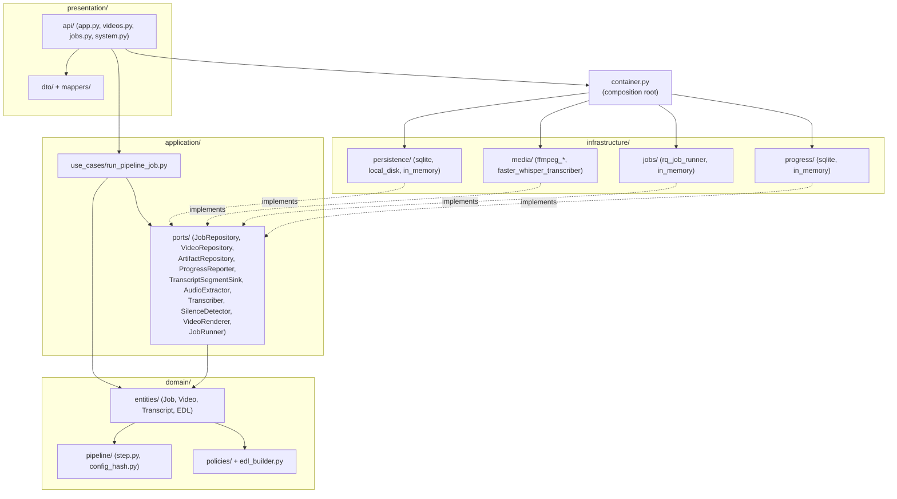
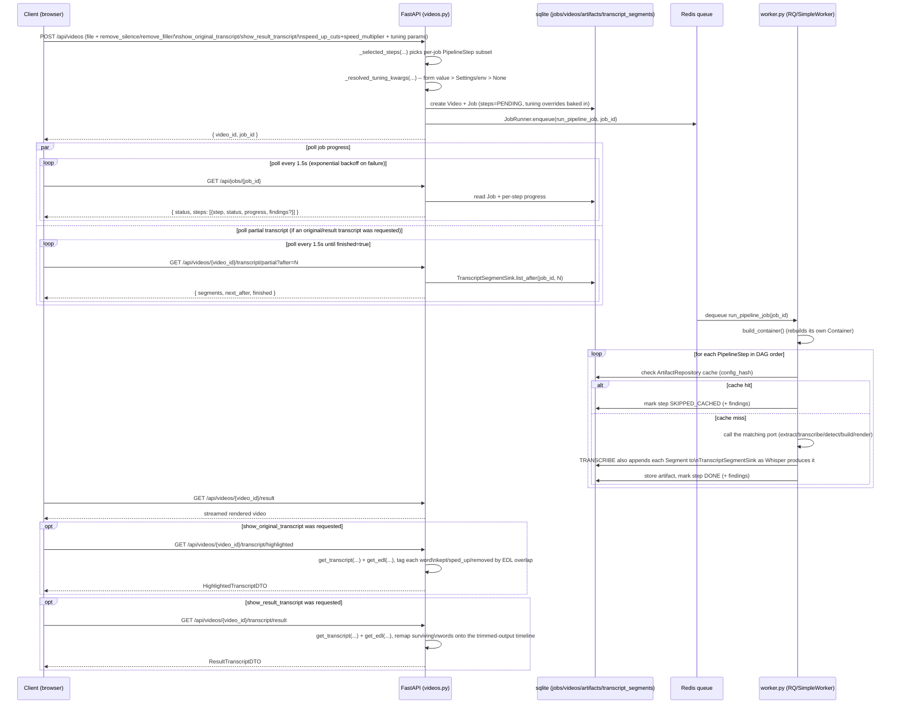
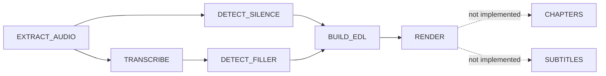

# Architecture

This document explains how deadair actually works end-to-end: the runtime flow of an upload
through the pipeline, and a layer-by-layer map of the server code. For the SOLID rationale
behind the hexagonal layering, see [SOLID_PRINCIPLES.md](SOLID_PRINCIPLES.md). For dev commands
and testing conventions, see [CLAUDE.md](CLAUDE.md).

## Overview

deadair is an automated video-editing pipeline: upload a video, extract its audio, transcribe
it, detect silence and filler words, build an EDL (edit decision list), and render the cut.
Users can also opt into a plain transcript instead of (or alongside) cutting, tune the
silence/filler/EDL detection thresholds per upload, and choose to speed up cut ranges instead
of removing them outright. The backend (`server/`) is a Python/FastAPI app built as a strict
hexagonal / ports-and-adapters architecture; the frontend (`client/`) is a small static
HTML/JS scaffold served by the same process.

## Layer diagram

Dependencies point inward only: `presentation` depends on `application`, `application` depends
on `domain`, and `infrastructure` implements `application`'s ports. `container.py` is the one
place that wires concrete infrastructure adapters to those ports.

## Runtime flow

Job execution is genuinely asynchronous: the API process only enqueues work, and a separate
`python -m deadair.worker` process executes it. Nothing progresses past `pending` without the
worker running.

**Windows note**: `rq.Worker` normally forks a subprocess per job and enforces timeouts via
`SIGALRM`, neither of which exists on Windows. On `sys.platform == "win32"`, `worker.py` swaps in
`rq.SimpleWorker` (runs jobs in-process, no fork) with `death_penalty_class` overridden to
`rq.timeouts.TimerDeathPenalty` (thread+ctypes-based). Non-Windows platforms use real `rq.Worker`
unmodified.

## Pipeline step DAG

`domain/pipeline/step.py` declares `PipelineStep` as an enum whose *declaration order* is a
valid topological sort of `STEP_DEPENDENCIES` (asserted by
`tests/unit/domain/test_step_graph.py`):

`CHAPTERS` and `SUBTITLES` are declared in the enum (and appear as disabled "coming soon"
checkboxes in the client) but have no entry in `run_pipeline_job.py`'s `_step_configs_for(job)`,
so the orchestrator skips them — out of scope for v1.

Which steps actually run for a given job is decided per-upload by
`_selected_steps(*, remove_silence, remove_filler, show_original_transcript=False,
show_result_transcript=False)` in `presentation/api/videos.py`:

- `EXTRACT_AUDIO` — always included.
- `TRANSCRIBE` — included if `remove_filler`, `show_original_transcript`, **or**
  `show_result_transcript` is set (filler detection needs a transcript; so do both transcript
  display modes).
- `DETECT_SILENCE` — included if `remove_silence` is set.
- `DETECT_FILLER` — included if `remove_filler` is set.
- `BUILD_EDL`, `RENDER` — always included.

The upload endpoint returns `400` if none of `remove_silence`/`remove_filler`/
`show_original_transcript`/`show_result_transcript` is set (nothing meaningful to do).

### Per-job tuning overrides

Six pipeline knobs can be overridden per upload instead of always using the hardcoded step-config
defaults: `noise_floor_db`/`min_silence_duration` (silence detection), `padding_seconds`/
`min_keep_duration` (EDL building), and `filler_words`/`filler_case_sensitive` (filler detection).
Each resolves, in `_resolved_tuning_kwargs(...)`, as **upload form field > `Settings`/env fallback
> `None`** (`None` ultimately falls back further to the hardcoded dataclass default in
`_step_configs_for`). The resolved value — not the raw form/env input — is baked into the `Job` at
creation time in `videos.py`'s `upload_video`, so it participates correctly in
config-hash-based caching (two jobs with the same effective tuning produce the same cache key,
regardless of whether the value came from the form or the org-wide fallback). `videos.py` returns
`400` if `min_silence_duration`/`padding_seconds`/`min_keep_duration` is negative (mirrored by a
`Settings` field validator for the org-wide fallback).

Each step's cache key is an `ArtifactKey(video_id, step, config_hash)`, where `config_hash`
(from `domain/pipeline/config_hash.py`) is computed from the step's own config plus every
upstream step's hash, so changing an upstream config invalidates everything downstream. Because
a job may omit steps (e.g. no `DETECT_FILLER`), `run_pipeline_job.compute_step_hashes(job)`
uses a `"skipped"` sentinel hash for any dependency the job didn't request, so hashing stays
consistent whether or not a given upstream step ran. This same function lets the transcript
endpoints (below) recompute a step's artifact key without re-executing the pipeline.

## Layer-by-layer reference

### Domain (`server/src/deadair/domain/`)

Pure logic — no I/O, no framework imports.

- `entities/job.py` — `Job` is an immutable, frozen dataclass. `with_step_updated(...)`
  transitions a step's `StepState` and derives the overall `JobStatus`; it accepts an optional
  `findings: dict[str, float] | None`, populated for `DETECT_SILENCE`/`DETECT_FILLER` as
  `{"cuts": <count>, "seconds_removed": <total duration>}` — this is what the client renders as
  "N cuts, X.Xs removed" next to those steps. Besides `speed_multiplier`, `Job` carries the six
  per-job tuning overrides described above (`noise_floor_db`, `min_silence_duration`,
  `padding_seconds`, `min_keep_duration`, `filler_words`, `filler_case_sensitive`), all `None`
  unless the upload resolved a value for them. `cancel()` and the transition rules raise
  `InvalidJobTransitionError` once a job is terminal (`DONE`/`FAILED`/`CANCELLED`).
- `entities/transcript.py` — `Word`, `Segment`, `Transcript` (`video_id`, `segments`,
  `language`, `all_words()`). Segments carry per-word timestamps; the presentation-layer
  transcript DTOs intentionally drop that word-level detail except where a feature specifically
  needs it (see `HighlightedTranscriptDTO` below).
- `entities/video.py` — video metadata.
- `entities/edl.py` — `EdlSegment(range: TimeRange, rate: float = 1.0)` and `EDL(video_id,
  segments, total_duration)`. `rate == 1.0` is a normal-speed "keep" range; `rate > 1.0` is a
  range that would otherwise be cut but is instead retained and sped up.
  `EDL.cut_ranges()` is *derived* as the complement of `segments`' ranges over
  `[0, total_duration]` — never separately tracked — so "present + cut fully partitions the
  timeline, no gaps or overlaps" holds by construction, enforced by `__post_init__`.
- `pipeline/step.py` — `PipelineStep` enum + `STEP_DEPENDENCIES`, `upstream_of`/`downstream_of`.
- `pipeline/config_hash.py` — `compute_config_hash(step, own_config, upstream_hashes)` and
  `STEP_ALGO_VERSION` (bump this when a step's internal algorithm changes in a way not captured
  by config fields, to force cache invalidation).
- `pipeline/step_configs.py` — per-step config dataclasses. `TranscribeConfig` includes
  `condition_on_previous_text`/`vad_filter` (both `False` by default) and an `initial_prompt`
  defaulting to a string nudging Whisper to transcribe filler words verbatim instead of
  "cleaning up" the transcript — filler detection depends on filler words actually appearing in
  the transcript.
- `policies/silence_policy.py` — `SilenceDetectionConfig(noise_floor_db=-35.0,
  min_silence_duration=0.5)` and `filter_cuttable_silences` (applies `min_silence_duration` to
  raw candidate gaps from the infra `SilenceDetector`).
- `policies/filler_policy.py` — `FillerWordConfig(words=DEFAULT_FILLER_WORDS,
  case_sensitive=False)`, `find_filler_words`, `is_filler_word`. `parse_filler_words(raw: str)`
  splits a comma-separated string (an upload form field or `Settings.filler_words`) into the
  `frozenset[str]` `FillerWordConfig.words` expects.
- `edl_builder.py` — `BuildEdlConfig(padding_seconds=0.15, min_keep_duration=0.3,
  speed_multiplier=None)` and `build_edl(...)`, which unions silence + filler cut ranges, pads
  them inward, derives keep ranges as the complement, drops keep ranges shorter than
  `min_keep_duration`, and — if `speed_multiplier` is set — retains the remaining gaps as
  sped-up segments instead of dropping them. `map_to_result_time(t, segments)` maps a timestamp
  on the original timeline to where it lands on the trimmed-output timeline (proportionally
  inside a segment, accounting for `rate`; clamped forward through a genuine gap).

### Application (`server/src/deadair/application/`)

- `ports/` — ten abstract interfaces implemented by infrastructure: `JobRepository`,
  `VideoRepository`, `ArtifactRepository`, `ProgressReporter`, `TranscriptSegmentSink`,
  `AudioExtractor`, `Transcriber`, `SilenceDetector`, `VideoRenderer`, `JobRunner`. Each raises
  its own domain-specific errors (`JobNotFoundError`, `JobAlreadyExistsError`, etc.) rather than
  leaking storage-specific exceptions. `TranscriptSegmentSink.append`/`list_after` is an
  incremental sink for transcript segments as they're produced mid-transcription, distinct from
  `ArtifactRepository`'s whole-`Transcript` caching — it's what lets the API stream segments to
  the client before the `TRANSCRIBE` step (or the job) finishes.
- `use_cases/run_pipeline_job.py` — the orchestrator, and the most important file in the
  codebase to understand:
  - `run_pipeline_job(job_id: str)` is a **top-level, dotted-path-importable** function — never
    wrapped in a closure/bound method — because the real RQ-based runner executes it in a
    separate worker process that imports it by dotted path with plain picklable args. It rebuilds
    its own `Container` via `build_container()` rather than receiving one by reference.
  - `_step_configs_for(job)` layers `Job`'s per-job overrides onto each step's config: only the
    fields the job actually set (non-`None`) override the dataclass default, so a job that set
    nothing produces identical configs to before this feature existed.
  - For each step, in DAG order: compute the config hash, check `ArtifactRepository` for a
    cached result (mark `SKIPPED_CACHED` if found), otherwise call the matching port method,
    serialize the result, store it, then move on. Failures caught from `_PORT_ERRORS`
    (`AudioExtractionError`, `TranscriptionError`, `SilenceDetectionError`, `RenderError`) mark
    the step `FAILED` and stop the job. `TRANSCRIBE` additionally forwards an `on_segment`
    callback into `container.transcript_segment_sink.append(...)` so segments stream out as
    Whisper produces them.
  - `_findings_for(step, state)` — computes the `findings` dict described above for
    `DETECT_SILENCE`/`DETECT_FILLER`; `None` for other steps. Passed into every
    `with_step_updated(...)` call, both cache-hit and freshly-computed paths.
  - `compute_step_hashes(job) -> dict[PipelineStep, str]` — factored out of the main run loop so
    a job's artifact keys can be recomputed without re-executing it (using the `"skipped"`
    sentinel described above).
  - `get_transcript(container, video_id, job) -> Transcript | None` — read-only helper. Looks up
    the job's `TRANSCRIBE` `StepState`; returns `None` if that step wasn't requested or isn't
    `DONE`/`SKIPPED_CACHED`; otherwise recomputes the artifact key via `compute_step_hashes` and
    fetches+deserializes the cached transcript from `ArtifactRepository`.
  - `get_edl(container, video_id, job) -> EDL | None` — the same pattern for the `BUILD_EDL`
    artifact, used by the result/highlighted transcript endpoints below.

### Infrastructure (`server/src/deadair/infrastructure/`)

Concrete adapters for the ports above. `container.py`'s `build_container()` wires the real ones
into production; tests use the fakes/in-memory ones directly.

- `persistence/in_memory/` — dict-backed `JobRepository`/`VideoRepository`/`ArtifactRepository`,
  test-only.
- `persistence/sqlite/` — real `JobRepository`/`VideoRepository`/`ProgressReporter`/
  `TranscriptSegmentSink` (schema in `persistence/sqlite/schema.sql`), used in production.
  - `connection.py` — `create_connection` runs the base schema then a list of additive
    `ALTER TABLE jobs ADD COLUMN ...` statements (one per optional column added over time —
    `speed_multiplier`, the six tuning-override columns, etc.), each wrapped in a
    try/`sqlite3.OperationalError`/pass so re-running against an existing on-disk db is a no-op.
  - `job_repository_sqlite.py` — serializes `findings` via `_steps_to_json`/`_json_to_steps`
    (reads use `item.get("findings")` for backward compatibility with rows written before the
    field existed) and the six tuning-override columns alongside `speed_multiplier`;
    `filler_words` round-trips through a `filler_words_json` column (sqlite has no native
    set/array type) via `json.dumps(sorted(...))`/`json.loads(...)`.
  - `transcript_segment_sink_sqlite.py` — `SqliteTranscriptSegmentSink`, backed by the
    `transcript_segments` table (`INSERT OR REPLACE` keyed on `(job_id, seg_index)`), so a
    reprocessed job's stream starts clean rather than appending duplicates.
- `persistence/local_disk/` — `DiskArtifactRepository`, stores step artifacts as files under
  `data_dir/artifacts`.
- `media/fake_*.py` (`fake_audio_extractor`, `fake_transcriber`, `fake_silence_detector`,
  `fake_video_renderer`) — used only by fast/isolated tests; not wired into `build_container()`.
- `media/ffmpeg_runner.py` — shared subprocess helper (`run_ffmpeg`), raises
  `FfmpegInvocationError` with the last ~20 lines of stderr on non-zero exit.
- `media/ffmpeg_audio_extractor.py` — real `AudioExtractor`.
- `media/ffmpeg_silence_detector.py` — real `SilenceDetector`; builds ffmpeg's `silencedetect`
  filter string from `SilenceDetectionConfig.noise_floor_db`/`min_silence_duration` and parses
  candidate gaps out of stderr (does not itself apply `min_silence_duration` as a keep/drop
  filter — that's `silence_policy.filter_cuttable_silences`, called by the orchestrator).
- `media/faster_whisper_transcriber.py` — real `Transcriber`; lazily loads/caches a
  `WhisperModel` per adapter instance, keyed by per-job `model_name` (device/compute_type come
  from `Settings`); passes `condition_on_previous_text`/`vad_filter`/`initial_prompt` from
  `TranscribeConfig` straight through to `model.transcribe(...)`; reports fractional progress via
  `on_progress` and streams each finished segment via `on_segment`; wraps failures in
  `TranscriptionError`.
- `media/ffmpeg_video_renderer.py` — real `VideoRenderer`; re-encodes each EDL segment as its own
  output segment (applying `setpts`/`atempo` filters for segments with `rate != 1.0`, i.e. sped-up-
  instead-of-cut ranges), then concatenates via ffmpeg's concat demuxer; skips concat entirely for
  single-segment EDLs; raises `RenderError` on empty `segments`.
- `jobs/in_memory_job_runner.py` — synchronous, in-process `JobRunner` fake, test-only.
- `jobs/rq_job_runner.py` — real `JobRunner`; takes an already-constructed Redis connection
  (testable against `fakeredis`); sets a generous 1-hour `job_timeout` on every enqueue.
- `progress/in_memory_progress_reporter.py` — in-memory fake, test-only.

### Presentation (`server/src/deadair/presentation/`)

FastAPI layer.

- `api/app.py` — `create_app(container)` builds the `FastAPI` app, stashes `Container` on
  `app.state.container`, mounts the `videos`/`jobs`/`system` routers, registers error handlers,
  and (if `client/` exists on disk) mounts it as static files at `/` via `StaticFiles(html=True)`
  — so the upload page is served by the same process at the same origin as `/api/...`.
  `api/deps.py`'s `get_container(request)` pulls the container back off app state.
- `api/videos.py`:
  - `POST /api/videos` — multipart upload; hashes the file, probes metadata,
    `_selected_steps(...)` builds the per-job step tuple (see DAG section above),
    `_resolved_tuning_kwargs(...)` resolves the six tuning overrides (form > Settings/env >
    `None`), creates a `Video` + `Job` with both baked in, enqueues `run_pipeline_job`. `400` if
    no option flag is set, if `speed_up_cuts` lacks `remove_silence`/`remove_filler`, if
    `speed_multiplier` isn't one of `(2.0, 4.0, 8.0)`, or if a tuning param is negative.
  - `GET /api/videos`, `GET /api/videos/{id}` — listing/lookup.
  - `GET /api/videos/{id}/result` — streams the rendered file; `409` if `RENDER` isn't `DONE`.
  - `GET /api/videos/{id}/transcript` — `404` if the video/job doesn't exist, else calls
    `get_transcript(container, video_id, job)`; `409` ("transcript not requested or not ready
    yet") if that returns `None`, else `transcript_to_dto(transcript)`.
  - `GET /api/videos/{id}/transcript/result` — same lookup as above, plus `get_edl(...)` (`409`
    if the EDL isn't built yet); returns `build_result_transcript(transcript, edl)` — words that
    survived the cuts, remapped onto the trimmed-output timeline.
  - `GET /api/videos/{id}/transcript/highlighted` — same transcript+EDL lookup; returns
    `build_highlighted_transcript(transcript, edl)` — every original word tagged
    `kept`/`sped_up`/`removed`, on the original timeline (nothing dropped or remapped), for
    inline highlighting of the untrimmed transcript.
  - `GET /api/videos/{id}/transcript/partial?after=N` — `409` if `TRANSCRIBE` wasn't requested
    for this job; otherwise returns segments from `TranscriptSegmentSink.list_after(job_id,
    after)` plus `next_after`/`finished`, for polling before the job completes.
- `api/jobs.py` — `GET /api/jobs/{id}` (job + per-step progress, including `findings`, via the
  DTO mapper), `POST /api/jobs/{id}/cancel`.
- `api/system.py` — `GET /api/system/storage-paths` returns `Settings`'s resolved on-disk paths
  (`StoragePathsDTO`); the client caches the response in `localStorage` so the "Storage details"
  panel still shows something (marked stale) if the backend is briefly unreachable.
- `dto/` + `mappers/` — Pydantic response models and pure mapping functions.
  - `dto/job_dto.py` / `mappers/job_mapper.py` — `StepStateDTO` carries the optional `findings`
    dict straight through from the domain `StepState`.
  - `dto/transcript_dto.py` / `mappers/transcript_mapper.py`:
    - `TranscriptDTO`/`TranscriptSegmentDTO` — full original transcript, segment-level timing
      only (`transcript_to_dto` deliberately drops `Segment.words`).
    - `PartialTranscriptDTO` — `partial_transcript_to_dto` wraps a page of segments plus
      `next_after`/`finished` for the polling endpoint above.
    - `ResultTranscriptDTO`/`ResultTranscriptSegmentDTO` — `build_result_transcript` filters
      each segment down to words overlapping some EDL segment, joins survivors' text, and
      records both `original_start`/`original_end` and `result_start`/`result_end` (via
      `map_to_result_time`).
    - `HighlightedTranscriptDTO`/`HighlightedSegmentDTO`/`HighlightedWordDTO` —
      `build_highlighted_transcript` keeps every word (nothing dropped) and tags each with
      `status: "kept" | "sped_up" | "removed"` via `_word_status`, which checks which EDL
      segment(s) overlap the word's timestamp and whether any has `rate == 1.0`.
- `main.py` — the ASGI entrypoint: loads `Settings` once, calls `configure_logging(settings)`,
  then `create_app(build_container(settings))` (so logging and container construction share one
  `Settings` instance rather than each loading their own).

### Container & config

- `container.py` — the composition root. `build_container(settings=None)` is the *only* place
  adapters get wired to ports; swapping an adapter means changing this function, not call sites.
  `run_pipeline_job` calls `build_container()` again with no args inside the worker process, so
  it must reconstruct an equivalent container from environment/settings alone.
- `config.py` — `Settings` (pydantic-settings), env-prefixed `DEADAIR_` (e.g.
  `DEADAIR_FFMPEG_BINARY_PATH`, `DEADAIR_DATA_DIR`, `DEADAIR_REDIS_URL`, `DEADAIR_RQ_QUEUE_NAME`,
  `DEADAIR_LOG_DIR`, default `./log`), loaded from env or `.env`, `extra="forbid"`. Also carries
  org-wide fallback defaults for the six per-job tuning params (`noise_floor_db`,
  `min_silence_duration`, `padding_seconds`, `min_keep_duration`, `filler_words` (comma-separated
  string), `filler_case_sensitive`) — every one defaults to `None` (no behavior change) and, when
  set, only applies to a job whose upload form omitted that field. `resolved_filler_words()`
  parses the comma-separated string into the `frozenset[str]` the domain expects.
- `logging_config.py` — `configure_logging(settings)` creates `settings.log_dir` if missing and
  attaches both a dated `FileHandler` (`log/deadair-YYYY-MM-DD.log`) and a
  `StreamHandler` (stderr), so logs from both the API and worker processes land in one place on
  disk without a separate log-shipping setup. Called from both `presentation/main.py` and
  `worker.py`.
- `worker.py` — `python -m deadair.worker` entrypoint; calls `configure_logging(settings)` right
  after loading settings, then starts the RQ worker (see the Windows note under Runtime flow).

## Client (brief)

`client/` (`index.html`, `app.js`, `style.css`) is a static, no-build, no-framework page served
directly by the FastAPI app at `/`. The upload form has checkboxes for `remove_silence`,
`remove_filler`, `speed_up_cuts` (with a `speed_multiplier` select: 2x/4x/8x), and
`show_original_transcript`/`show_result_transcript` (plus disabled "coming soon" checkboxes for
`CHAPTERS`/`SUBTITLES`), sent as form fields on `POST /api/videos`, mirroring the server-side
`_selected_steps()`/`_ALLOWED_SPEED_MULTIPLIERS` logic above. The six per-job tuning overrides
(`noise_floor_db`, etc.) are supported by the upload endpoint but **not yet exposed as client
form fields** — today they're only reachable via `Settings`/env (org-wide) or a direct API call
with extra form fields.

After upload, `app.js` runs three independent polling loops:
- `pollJob()` polls `GET /api/jobs/{id}` every 1.5s (exponential backoff on failure), renders
  per-step progress bars (including the `findings` summary — "N cuts, X.Xs removed" — for
  silence/filler steps), and on each tick also checks whether the result video, result
  transcript, or highlighted transcript have become fetchable.
- If `show_original_transcript` was checked, `pollTranscript()` polls `GET
  /api/videos/{id}/transcript/partial?after=N` independently (starting right after upload, not
  gated on job completion) and appends segments as Whisper produces them — until, once
  `BUILD_EDL` finishes, `maybeShowHighlightedTranscript()` fetches `GET
  /api/videos/{id}/transcript/highlighted` once and replaces the incrementally-streamed panel
  with a word-highlighted version (`.word-removed`/`.word-sped-up` CSS classes strike through or
  amber-highlight non-kept words).
- If `show_result_transcript` was checked, `maybeShowResultTranscript()` fetches `GET
  /api/videos/{id}/transcript/result` once `BUILD_EDL` finishes (that endpoint has no partial
  form) and renders original-time → result-time paragraph pairs.

On completion (`render` step `done`/`skipped_cached`) it points a `<video>` element at `GET
/api/videos/{id}/result`. A "Storage details" `
` panel fetches `GET
/api/system/storage-paths` on load and caches the result in `localStorage` so it still shows
something (marked stale) if the backend is briefly unreachable. A theme toggle persists
light/dark preference to `localStorage`. See `client/app.js` for the full implementation.

## Caching recap

Every step's output is content-addressed via `ArtifactKey(video_id, step, config_hash)` and
stored through `ArtifactRepository`; a job that recomputes the same step with the same upstream
chain gets `SKIPPED_CACHED` instead of re-running expensive work (ffmpeg/whisper calls). Because
the per-job tuning overrides are resolved to concrete values *before* being baked into the `Job`
(see "Per-job tuning overrides" above), two jobs with the same effective config hash the same way
regardless of whether a value came from the upload form or the org-wide `Settings` fallback. See
[CLAUDE.md](CLAUDE.md)'s Commands section for how to run the server/worker/tests locally.
